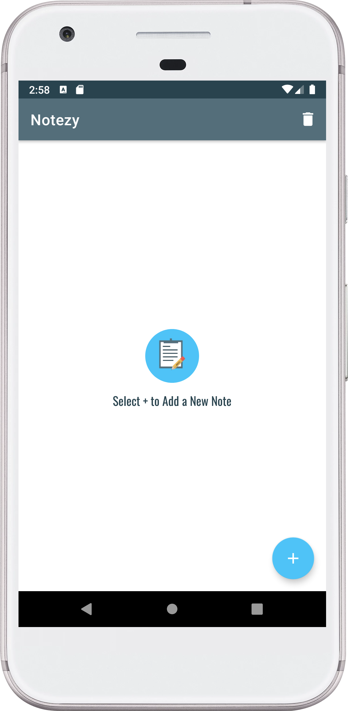
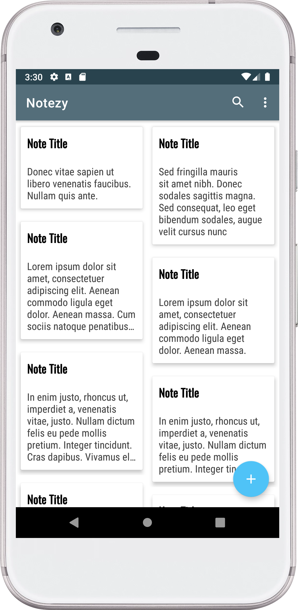
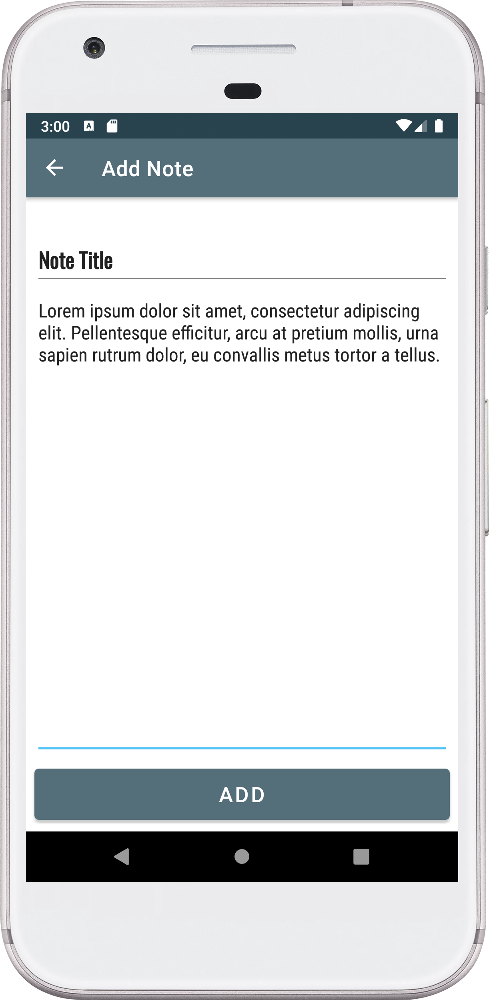
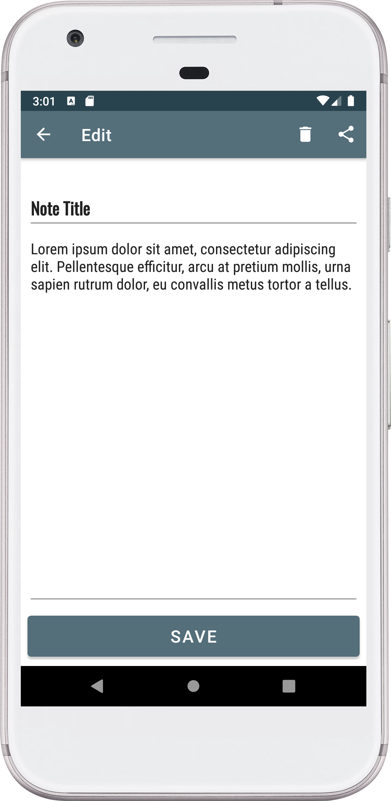
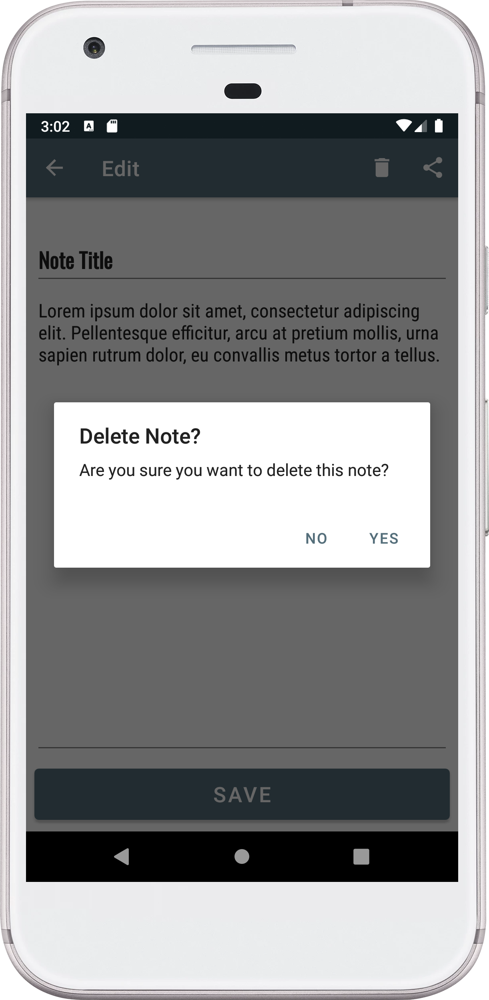
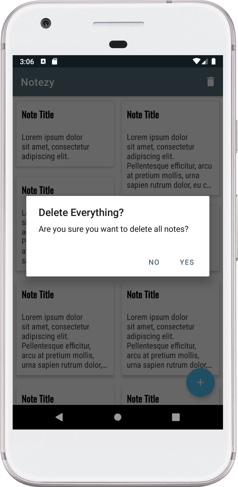
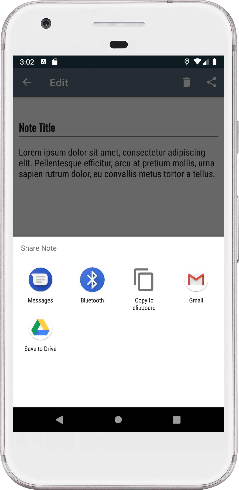

# Notezy
### An android Note Making app with Room Database packed with features like LiveData, MVVM architecture, etc.
It can be used in making your daily notes like tasks to perform in a day or a list of shopping items, etc.

## Libraries Used:
- [Room](https://developer.android.com/reference/androidx/room/RoomDatabase)
- [Navigation](https://developer.android.com/guide/navigation)
- [Lifecycle](https://developer.android.com/jetpack/androidx/releases/lifecycle)
- [Databinding](https://developer.android.com/jetpack/androidx/releases/databinding)

# SCREENSHOTS
<table>
  <tr>
    <td></td>
    <td></td>
    <td></td>
    <td></td>
  </tr>
  <tr>
    <td></td>
    <td></td>
    <td></td>
    <td></td>
  </tr>
</table>
